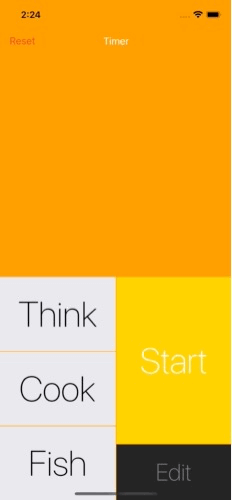
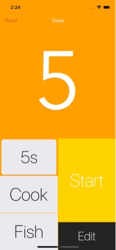
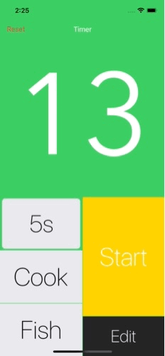

## Overview

Timer is a utility app that can store up to three user's defined count down timers, in addition, it can function like a stopwatch.

## Feature

* Edit Timer

The three preset count down timers can be edited through customized UIPickerView displaying hours, minutes and seconds:

* Background

If the app is in the background, even get terminated, the timer should still be calculated correctly, and inform user by notification:

* Stopwatch

In addition to count down timer, the app also provides stop watch functionality, to use it, just deselect any count down timer button, press start:

## License
Timer is released under the **MIT** license. See [LICENSE](https://opensource.org/licenses/MIT) for details